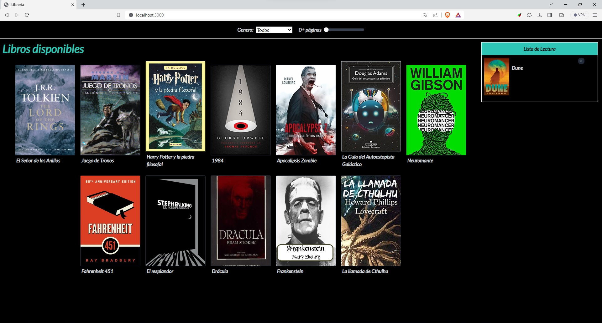

# Librería con React + Zustand + Tailwind + ViewTransition.

Antes de empezar,
[instala Compose](https://docs.docker.com/compose/install/).



### Software utilizado

```
react===18.2.0
zustand===4.3.9
```

## Deploy con docker compose

```
$ docker compose up -d
```

## Resultados esperados

La lista de contenedores debe mostrar un contenedor en ejecución y la asignación de puertos como se muestra a continuación:
```
$ docker ps
CONTAINER ID   IMAGE                     COMMAND                  CREATED       STATUS                 PORTS                               NAMES
b540689a0607   lista-libros-frontend   "docker-entrypoint.s…"   1 weeks ago   Up 6 hours             0.0.0.0:3000->3000/tcp              lista-libros
```

Luego vaya a `http://localhost:3000/` en su navegador web.